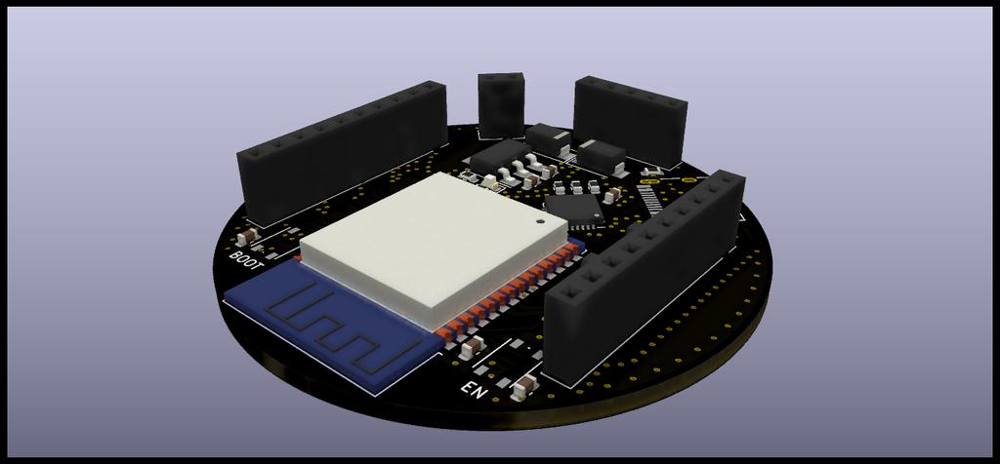
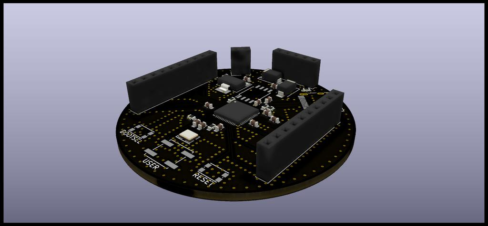
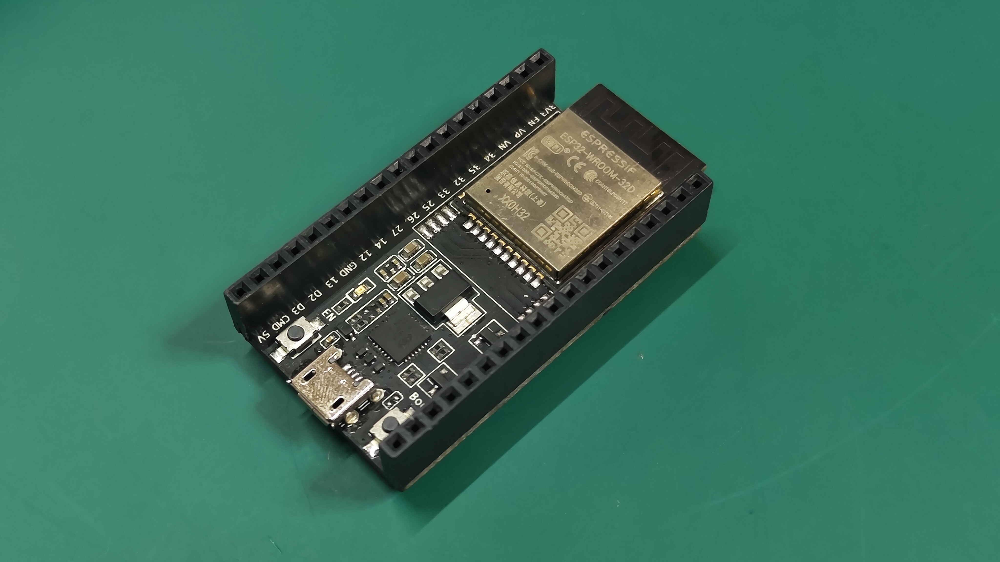
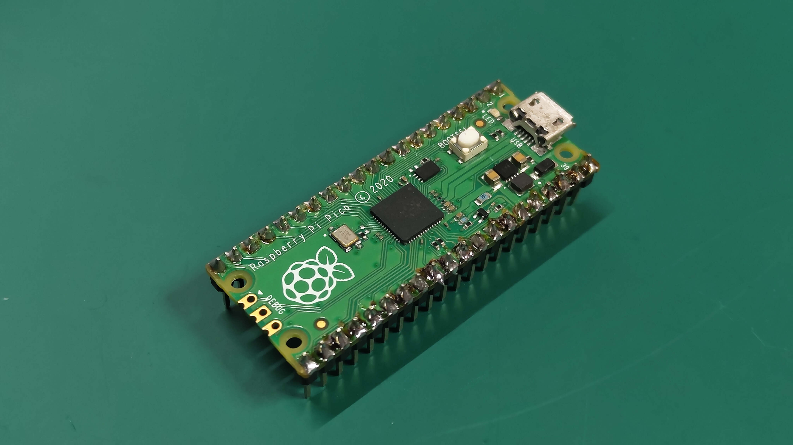
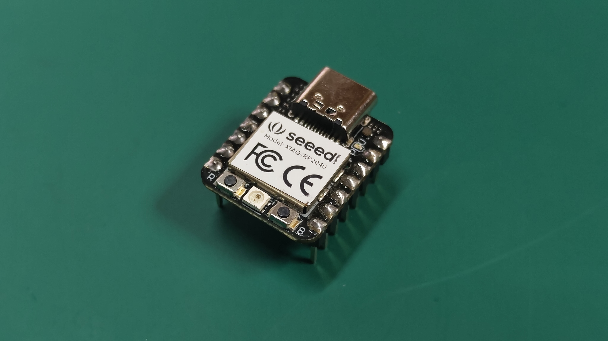
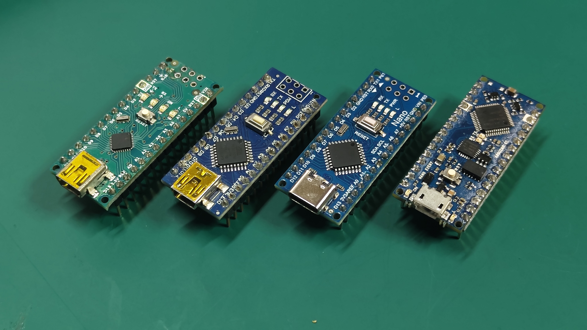

# 初心者のための缶サット開発

このリポジトリでは缶サット関連の情報を取り扱っています

派生元：[高校生のためのCanSat開発キット](https://github.com/meltingrabbit/CanSatForHighSchoolStudents) by meltingrabbit 氏

## 概要

- Arduino 環境を用いた缶サット開発を手助けする
- Rust, microPython による組み込みプログラミング学習に使用できるハードウェアを提供する（予定）

## 「缶サット」とは 

> **CanSat**（カンサット）あるいは**缶サット**（かんサット）とは、宇宙技術の教育を目的として、小型衛星で用いられるものと類似の技術を使用して製作される、飲料水の缶サイズの小型の模擬人工衛星である。あくまで模擬人工衛星であり、実際に大気圏を離脱したり地球を周回したりすることはない。 - [Wikipedia](https://ja.wikipedia.org/wiki/CanSat) （2022/12/22参照）

なお、このリポジトリ内では、「ジュース缶サイズに収まる大きさの超小型模擬人工衛星のこと」を缶サットとし、  
「目的や制約に応じて機能を取捨選択し、規定の大きさや重さなどに収めるための技術や実際にそれらを扱い目的を達成する技能を養う」ことを目的として公開します  
また、基板サイズは直径 Φ = 50.8 mm の円形に統一し、相互接続は 10 mm のピンソケットを使用することとします

## Arduino とは

ハードウェアである「Arduino ボード」と PC 用ソフトウェアである「Arduino IDE（統合開発環境）」によって構成されるエコシステムのことを指す  
「Arduino ボード」のことを単に Arduino と呼称することも多い（例：Arduino を使った電子工作）  
これらはすべてオープンソースであり、やる気さえあれば誰でも Arduino 互換ボードを作り、使用することができる  

Arduino IDE は Arduino ボードで使用するプログラム（スケッチ）の作成やデバッグ、コンパイル、ボードへの転送等を行う開発環境で、これに対応するマイコンボードを広義の Arduino ボードとすることもある  
Arduino ボードはワンボードマイコンの一種であり、複数の入出力ポートを備え、様々なデバイスを接続して使用することができる

スケッチの作成は C 言語風の言語である Arduino 言語を用いて作成するが、中身は殆ど C 言語と同一であり、ある程度の慣れは必要だが比較的容易にプログラミングが可能である

## マイコンとパソコンの違い

我々が普段使用するコンピュータ（PC; パソコン）は、一般的にはキーボードやマウスを入力とし、モニタに映る映像やスピーカから出る音を出力として動くものを指し、人間の操作によって動くソフトウェアをインストールして使用される。それに対してマイコン（マイクロコントローラ、マイクロコンピュータ）は主にセンサや周辺デバイスを入力とし、モータや LED、その他周辺機器等を出力として、基本的に独立して動作するという違いがある  
また、一般的な PC の CPU は 数 GHz という速度で動作し、何十 GB という容量のメモリを保有するが、マイコンの CPU は 十数 ~ 百数十 MHz という速度で動作し、数十 kB ~ 数百 MB 程度の比較的小容量のメモリを有するのみという、計算リソース的な面でも大きな差異が見られる

以下に、例として自宅にあるパソコン、Arduino UNO、Raspberry Pi Pico での比較を示す

| 簡易比較表 | パソコン | Arduino UNO | RasPico |
|----|:----:|:----:|:----:|
| 主な入力装置 | キーボード、マウス | センサ | センサ |
| 主な出力装置 | モニタ、スピーカ | GPIO、LED、アクチュエータ | GPIO、LED、アクチュエータ |
| CPU 周波数 | 3.7 ~ 5.3 GHz | 20 MHz | 133 MHz |
| RAM 容量 | 32 GB | 2 kB | 264 kB |
| ストレージ容量 | 500 GB, 1 TB | 32 kB | 2 MB |
| CPU アーキテクチャ | x64 | Atmel AVR | Arm Cortex-M0+ |
| 並列処理性能 | ◎ | ✕ | △※ |

※RP2040 はマルチコアプロセッサを搭載しているためプログラム次第では並列処理が可能になる

## 缶サットの構成要素

以下の①〜③のコンポーネントを、必要に合わせて選び、組み合わせることで缶サットを作成する

### ①ベース基板

※実際に缶サットを作成する際に使用する基板（画像は CAD イメージを使用しています）

- ESP32-Base

Espressif Systems 社の 32bit マイコンモジュール「ESP32-WROOM-32E」を搭載したモデル  
詳細は [about-ESP32-Base.md](./about-ESP32-Base.md) を

- RP2040-Base

Raspberry Pi 財団の 32bit マイコンチップ「RP2040」を搭載したモデル  
詳細は [about-RP2040-Base.md](./about-RP2040-Base.md) を

※RP2040_Base は開発停止しました

### ②観測基板等

※ベース基板の上に積み重ねるように接続して使用

丸型基板（[P-08758](https://akizukidenshi.com/catalog/g/gP-08758/)）、ピンソケット（10P：[C-07199](https://akizukidenshi.com/catalog/g/gC-07199/)｜5P：[C-06360](https://akizukidenshi.com/catalog/g/gC-06360/)）、その他センサ類を使用して各自で作成

製品によってはロジックレベル（≒動作電圧）が 5V のものもあるため、採用時には注意が必要  
RP2040-Base, ESP32-Base 共に 3.3V IO のため、基本的にはロジックレベルを揃えたほうが使いやすいが、レベルコンバータを使用することで異なる IO レベルのモジュールを使用することも可能

#### サポート予定のセンサ、モジュール

Arduino に対応していることを謳っているものであれば大体は使用可能です。ただし動作電圧には注意しましょう

- BME280 （[K-09421](https://akizukidenshi.com/catalog/g/gK-09421/)）
  - 温湿度・気圧センサモジュール
  - I2C、SPI インターフェース
- BMX055（[K-13010](https://akizukidenshi.com/catalog/g/gK-13010/)）
  - 9 軸加速度センサ
  - I2C インターフェース
  - 3.3V、5V 両対応
- GPS 受信機（[K-09991](https://akizukidenshi.com/catalog/g/gK-09991/)）
  - みちびき 対応 1PPS 出力付き
  - UART インターフェース
- XBee S2C（[M-10072](https://akizukidenshi.com/catalog/g/gM-10072/)）
  - ZigBee 規格（IEEE 802.15.4）での無線通信が可能なモジュール
  - SPI、UART インターフェース

### ③電源基板

基本的には要件に合わせたものを丸形基板を使用して作成する  
電源には 006P バッテリを使用し、レギュレータで電圧を落として使用することになるが、他にも選択肢はある

## 制作

ブレッドボードで試作する際は評価ボードを使用したり、ベースボードにジャンパ線を接続してブレッドボードに繋いだりしてスケッチの作成を行う

### 試作用マイコンボード

※ブレッドボード上で試作する際に使用

- ESP32-DevKit-C
  - 物によっては前世代の ESP32-WROOM-32D や 32無印を採用しているものもあるが、コアは同じなので試作には利用可能
  - ESP32-Base には 32E を採用

- Raspberry Pi Pico
  - RP2040-Base とピンアサイン・配置・USBコネクタ以外はほぼ同一

- Seeed Xiao RP2040
  - Seeed Studio 社が開発・販売しているマイコンボードシリーズ Xiao の RP2040 搭載版
  - GPIO は最小限しか使用できないが、非常に小型なため場合によっては有用

- Arduino Nano | Arduino Nano Every
  - Arduino 財団のマイコンボード。様々なベンダから互換品が発売されているため安価に入手可能
  - 写真は左から順に Arduino Nano 純正品、Arduino Nano 互換品、Arduino Nano 互換品 USB Type-C バージョン、Arduino Nano Every 純正品
  - ※5V IO
