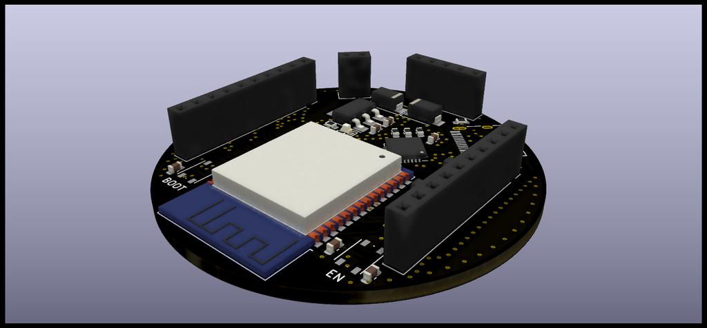

# ESP32-Base について

## 概要

- 搭載マイコン
  - Espressif ESP32-WROOM-32E
    - Tensilica Xtensa-LX6 デュアルコア 32 bit マイクロプロセッサ搭載
    - IEEE 802.11 b/g/n 対応
    - Bluetooth v4.2 対応
    - I2C, SPI, UART, GPIO
    - 16MB フラッシュメモリ内蔵
  - CP2102
    - USB - UART 変換 IC
    - プログラム書き込み用
- USB Type-C インターフェース採用
- 評価ボード同様 BOOT, EN の外部スイッチを搭載
- Wi-Fi※1、USB 経由でプログラムの書き込みが可能

※1：予め書き込んでおくプログラムに細工をしておく必要があり、また Wi-Fi アクセスポイントが必要となるため、使い所は限られる

## 回路図

## 基板イメージ

## インターフェース詳細

<table>
  <tr><th>インターフェース</th> <th>ピン番号</th> <th>機能</th>   <th>インターフェース</th>  <th>ピン番号</th> <th>機能</th></tr>
  <tr><td rowspan="10">J1</td> <td>1</td>       <td>GND</td>    <td rowspan="10">J2</td> <td>1</td>       <td>GND</td></tr>
  <tr>                         <td>2</td>       <td>UART RX</td>                         <td>2</td>       <td>IO35</td></tr>
  <tr>                         <td>3</td>       <td>UART TX</td>                         <td>3</td>       <td>IO34</td></tr>
  <tr>                         <td>4</td>       <td>IO16</td>                            <td>4</td>       <td>IO33</td></tr>
  <tr>                         <td>5</td>       <td>IO17</td>                            <td>5</td>       <td>IO32</td></tr>
  <tr>                         <td>6</td>       <td>IO18</td>                            <td>6</td>       <td>IO13</td></tr>
  <tr>                         <td>7</td>       <td>IO19</td>                            <td>7</td>       <td>IO14</td></tr>
  <tr>                         <td>8</td>       <td>IO21</td>                            <td>8</td>       <td>IO15</td></tr>
  <tr>                         <td>9</td>       <td>IO22</td>                            <td>9</td>       <td>3.3V</td></tr>
  <tr>                         <td>10</td>      <td>IO23</td>                            <td>10</td>      <td>IO12</td></tr>
</table>

<table>
  <tr><th>インターフェース</th> <th>ピン番号</th> <th>機能</th></tr>
  <tr><td rowspan="5">J3</td>  <td>1</td>       <td>IO4</td></tr>
  <tr>                         <td>2</td>       <td>IO5</td></tr>
  <tr>                         <td>3</td>       <td>3.3V</td></tr>
  <tr>                         <td>4</td>       <td>VIN</td></tr>
  <tr>                         <td>5</td>       <td>GND</td></tr>
</table>

<table>
  <tr><th>インターフェース</th>    <th>ピン番号</th> <th>機能</th></tr>
  <tr><td rowspan="2">Power</td> <td>1</td>        <td>VIN</td></tr>
  <tr>                           <td>2</td>        <td>GND</td></tr>
</table>
