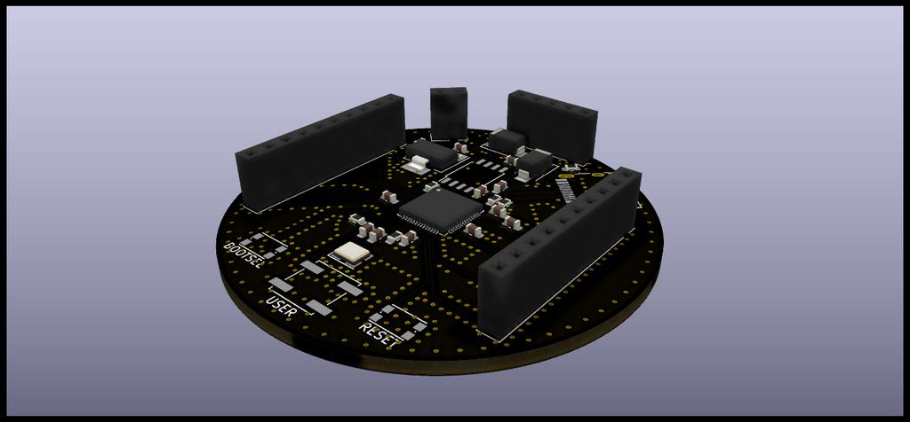

# RP2040-Base について

## 概要

- 搭載マイコン
  - Raspberry Pi Foundation RP2040
    - Arm Cortex-M0+ デュアルコア 32 bit マイクロプロセッサ搭載
    - I2C, SPI, UART, GPIO
- USB Type-C インターフェース採用
- BOOTSEL, RESET に加えユーザが任意の用途で使用できるオプションスイッチを搭載
  - GPIO15 に接続し、プルアップ抵抗実装済み
  - USER スイッチに使うスイッチはこちら：（[P-15969](https://akizukidenshi.com/catalog/g/gP-15969/)）

## 回路図

## 基板イメージ

## インターフェース詳細

<table>
  <tr><th>インターフェース</th> <th>ピン番号</th> <th>機能</th><th>インターフェース</th> <th>ピン番号</th> <th>機能</th></tr>
  <tr><td rowspan="10">J1</td> <td>1</td>       <td>GND</td><td rowspan="10">J2</td> <td>1</td>       <td>GND</td></tr>
  <tr>                         <td>2</td>       <td>GP2</td>                         <td>2</td>       <td>GP29</td></tr>
  <tr>                         <td>3</td>       <td>GP3</td>                         <td>3</td>       <td>GP28</td></tr>
  <tr>                         <td>4</td>       <td>GP4</td>                         <td>4</td>       <td>GP27</td></tr>
  <tr>                         <td>5</td>       <td>GP5</td>                         <td>5</td>       <td>GP26</td></tr>
  <tr>                         <td>6</td>       <td>GP6</td>                         <td>6</td>       <td>GP19</td></tr>
  <tr>                         <td>7</td>       <td>GP7</td>                         <td>7</td>       <td>GP18</td></tr>
  <tr>                         <td>8</td>       <td>GP8</td>                         <td>8</td>       <td>GP17</td></tr>
  <tr>                         <td>9</td>       <td>GP9</td>                         <td>9</td>       <td>3.3V</td></tr>
  <tr>                         <td>10</td>      <td>GP10</td>                        <td>10</td>      <td>GP16</td></tr>
</table>

<table>
  <tr><th>インターフェース</th> <th>ピン番号</th> <th>機能</th></tr>
  <tr><td rowspan="5">J3</td>  <td>1</td>       <td>GP1</td></tr>
  <tr>                         <td>2</td>       <td>GP0</td></tr>
  <tr>                         <td>3</td>       <td>3.3V</td></tr>
  <tr>                         <td>4</td>       <td>VIN</td></tr>
  <tr>                         <td>5</td>       <td>GND</td></tr>
</table>

<table>
  <tr><th>インターフェース</th>   <th>ピン番号</th> <th>機能</th></tr>
  <tr><td rowspan="2">Power</td> <td>1</td>       <td>VIN</td></tr>
  <tr>                           <td>2</td>       <td>GND</td></tr>
</table>
